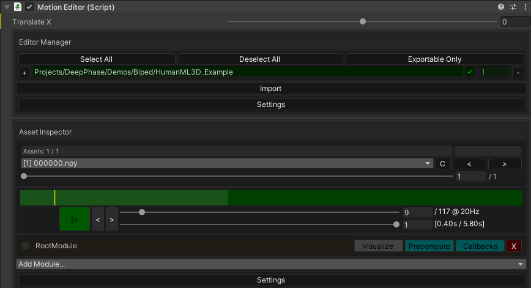
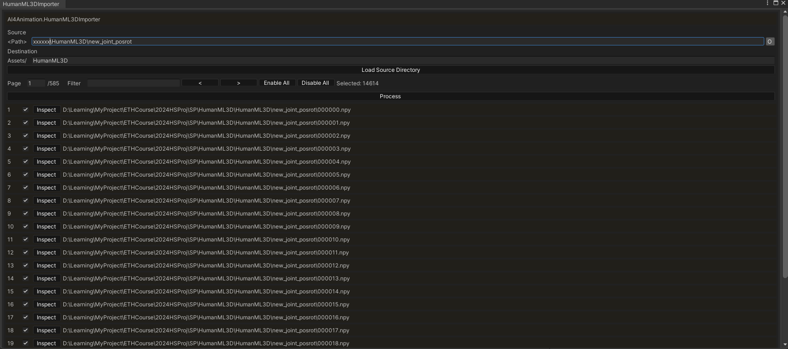
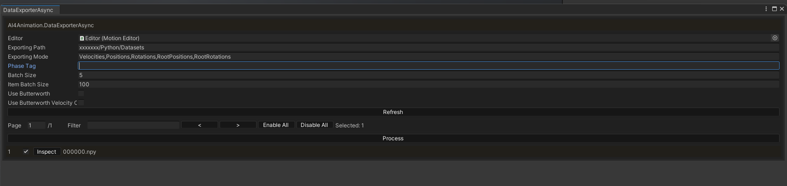
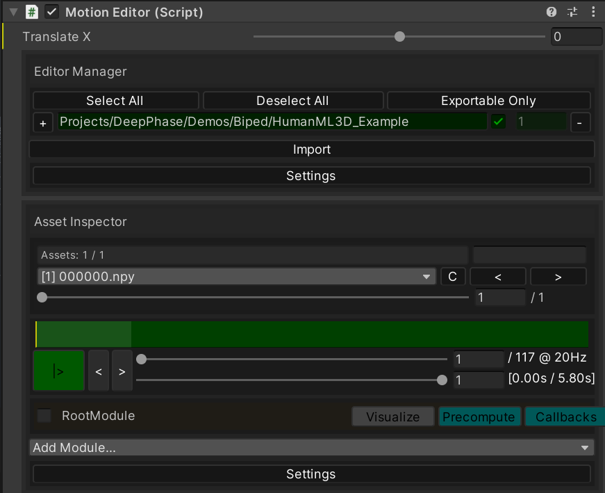

# Unity Framework for MotionPyramid

This repository provides the Unity framework used in **MotionPyramid: Controllable Motion Synthesis via Stylized Phase Manifolds** for data processing, visualization, and demos.

## Prerequisites

Open this directory as a Unity project.

Download the pre-processed motion data and pre-trained models from [Google Drive](https://drive.google.com/drive/folders/1Tq-V6qf6q3_Ufu-fJOEJ1kXXRY6GM5MP?usp=sharing), extract it and put it under `Assets/Projects/DeepPhase/Demos`.

Open the project with Unity. The project is developed with Unity 2022.3.8f1 on Windows.


## Data Processing in Unity

### Load a Small Example

Before importing your own data, you can open the small HumanML3D example scene and preview motions directly in Unity.

1. Open `Assets/Projects/DeepPhase/Demos/Biped/HumanML3d.unity`.
2. In the `Motion Editor` inspector, set the motion editing file path to the small example path, such as `Projects/DeepPhase/Demos/Biped/HumanML3D_Example`.
3. Click `Import`, then use the playback controls in the asset inspector to play the loaded motion.



### Preprocess HumanML3D Data

Start from the same HumanML3D setup as the original dataset: [EricGuo5513/HumanML3D](https://github.com/EricGuo5513/HumanML3D).

To generate the Unity-ready joint position and rotation data, download the preprocessing scripts from [Google Drive](https://drive.google.com/drive/folders/1WB0ft9cuR6wpNbePn298m8L0UOfaWBBy?usp=sharing), run them on the HumanML3D joint folder, and export the result to `HumanML3D/new_joint_posrot`.

Alternatively, download the precomputed `new_joint_posrot` data from the same Google Drive folder and unzip it into the HumanML3D data directory.

### Import Data

1. For HumanML3D data, use `AI4Animation -> Importer -> HumanML3D Importer`. For customized datasets, use `AI4Animation -> Importer -> BVH Importer` for BVH files or FBX Importer for FBX files.



2. Duplicate the scene `Assets/Projects/DeepPhase/Demos/Biped/HumanML3d.unity`. In the Inspector of `Editor`, put the path for imported data in Editor Manager in the Inspector of `MotionEditor` and hit `Import`.

3. Use `AI4Animation -> Tools -> Pre Process` to calculate the root coordinate.

### Export Data for Training

Use `AI4Animation -> Tools -> Data Exporter (Async)` to export the pre-processed data.

For `Editor`, choose the MotionEitor containing all the data you need.



For stylized manifold training, set `Exporting Mode` to `Velocities,Positions,Rotations`. In the `Exporting Path` field, use the absolute path on your PC that points to `Python/Datasets/HumanML3D`.

For diffusion model training, export the data again with `Exporting Mode` set to `Velocities,Positions,Rotations,RootPositions,RootRotations`. In the `Exporting Path` field, use the absolute path on your PC that points to `Python/Datasets/HumanML3DwithRoot`.

You can use the default settings for the rest of the options.

### Prepare the HumanML3D Test Split for Root Data

  For the diffusion dataset exported to `Python/Datasets/HumanML3DwithRoot`, copy the official HumanML3D test split file from the
  [EricGuo5513/HumanML3D](https://github.com/EricGuo5513/HumanML3D) dataset.

```text
HumanML3D/test.txt
```

Paste it into:

```text
Python/Datasets/HumanML3DwithRoot/
```

Then rename it to:

```text
HumanML3D_test.txt
```

The final file should be:

```text
Python/Datasets/HumanML3DwithRoot/HumanML3D_test.txt
```

The Python data loader expects this filename when loading `HumanML3DwithRoot`; the later train/test split files are handled automatically by the code.

### Calculate Foot Contact Labels

For diffusion model training, generate `foot_contact_results.npz` from the dataset exported with root channels.

Before running this step, set up the Python environment by following [`Python/README.md`](../Python/README.md).

From the repository root, run the command without `--compare`:

```bash
python ./Python/tools/build_foot_contact_from_root.py --dataset ./Python/Datasets/HumanML3DwithRoot --overwrite
```

This writes:

```text
Python/Datasets/HumanML3DwithRoot/foot_contact_results.npz
```

### Prepare the Text-to-Phase Dataset

The text-to-phase training data is prepared from the full exported HumanML3D motion dataset and the HumanML3D text annotations.

1. Create the target text-to-phase dataset folder: `Python/Datasets/HumanML3DwithRoot_Text`.

2. Copy the exported motion files into that folder:
   - `Data.bin`
   - `Description.txt`
   - `Sequences.txt`
   - `clip/`

   If you do not already have the `clip/` folder, download it from [Google Drive](https://drive.google.com/file/d/1T6jTcg-KoiQyOLoWTtA83PLe2WAnBC6h/view?usp=sharing).

3. Copy `txt.zip` from the HumanML3D dataset and unzip it in the target dataset folder.

4. Copy `index.csv` from the HumanML3D dataset. The intervals in `index.csv` are left-closed and right-open: `[start, end)`.

5. Convert the copied `Sequences.txt` into the text-to-phase sequence metadata. From the repository root, run:

   ```bash
   python ./Python/utils/text2phase/HumanML3D/sequence_process.py --input ./Python/Datasets/HumanML3DwithRoot_Text/Sequences.txt --output ./Python/Datasets/HumanML3DwithRoot_Text/Sequences.txt
   ```

   The frame intervals in the exported `Sequences.txt` are left-closed and right-closed: `[start, end]`.

6. Combine the `index.csv` information and sequence information into the final text-to-phase metadata. From the repository root, run:

   ```bash
   python ./Python/utils/text2phase/HumanML3D/text2phase_process.py --index ./Python/Datasets/HumanML3DwithRoot_Text/index.csv --sequence ./Python/Datasets/HumanML3DwithRoot_Text/Sequences.txt --output ./Python/Datasets/HumanML3DwithRoot_Text/text2phase.csv
   ```

   In the generated metadata, `global_start` and `global_end` are left-closed and right-open: `[global_start, global_end)`.

7. Copy the HumanML3D split files:
   - `all.txt`
   - `train.txt`
   - `val.txt`
   - `test.txt`
   - `train_val.txt`

## Visualize Phase-to-Motion Results

After running phase-to-motion inference in the Python module, you can review the generated `.npz` motions in Unity.

1. Open `Assets/Projects/DeepPhase/Demos/Biped/Phase2Motion_HumanML3d.unity`.

2. Select `Editor-human` in the hierarchy. In the `Motion Editor` inspector, make sure the editor path is linked to an available folder containing imported motion data, such as `Projects/DeepPhase/Demos/Biped/HumanML3D_Example`. Click `Import` if the assets are not loaded yet.



3. Select `Phase2motion_HumanML3D` in the hierarchy. In its `NpzController`, set `Npz File Prefix` to your local `Python/results/` folder and set `Npz File Path` to the ground-truth motion file:

   ```text
   Npz File Prefix: <your-path>/MotionPyramid_private/Python/results/
   Npz File Path: HumanML3D_difftest_3\generate\gt4_motion.npz
   ```

   This object shows the ground-truth motion in green.

4. Under `Phase2motion_HumanML3D`, select `ONNXControllerHuman`. In its `NpzController`, use the same prefix and set `Npz File Path` to the generated diffusion motion:

   ```text
   Npz File Prefix: <your-path>/MotionPyramid_private/Python/results/
   Npz File Path: HumanML3D_difftest_3\generate\df4_motion.npz
   ```

   This object shows the generated motion in purple.

5. Press Play in Unity to compare the ground-truth and generated motions.

## Rider-Based Unity Development

If you want to use JetBrains Rider for C# development, open the project through Unity first and let Unity generate the Rider project files.

Recommended workflow:

1. Close Rider.
2. Open this Unity project with Unity Hub.
3. In Unity, go to `Edit > Preferences > External Tools` and set `External Script Editor` to Rider.
4. Click `Regenerate project files`, or use `Assets > Open C# Project` to open Rider from Unity.
5. After regeneration, the project root should contain generated files such as `Unity.sln` and `Assembly-CSharp.csproj`.
6. Do not use Rider to build the final Unity game package. Unity builds should be created from the Unity Editor with `File > Build Settings > Build`. Rider is mainly for code editing, navigation, and script compile checks.

In short, opening this repository directly as a normal Rider/.NET solution can trigger MSBuild errors because the Unity-generated `.sln` and `.csproj` files may not exist yet, and the IDE may treat the folder like a regular .NET or Python-style project. Open the project from Unity first, regenerate the C# project files, and then use Rider from Unity.

## Acknowledgments

This Unity framework is adapted from [WalkTheDog: Cross-Morphology Motion Alignment via Phase Manifolds](https://peizhuoli.github.io/walkthedog/index.html).

The code is adapted from the [DeepPhase](https://github.com/sebastianstarke/AI4Animation/tree/master?tab=readme-ov-file#siggraph-2022deepphase-periodic-autoencoders-for-learning-motion-phase-manifoldssebastian-starkeian-masontaku-komuraacm-trans-graph-41-4-article-136) project under [AI4Animation](https://github.com/sebastianstarke/AI4Animation/tree/master/AI4Animation/SIGGRAPH_2022/Unity) by [@sebastianstarke](https://github.com/sebastianstarke).

The code under `Assets/Scripts/Animation/Intertialization` is adapted from [MotionMatching](https://github.com/JLPM22/MotionMatching) by Jose Luis Ponton ([@JLPM22](https://github.com/JLPM22)).


